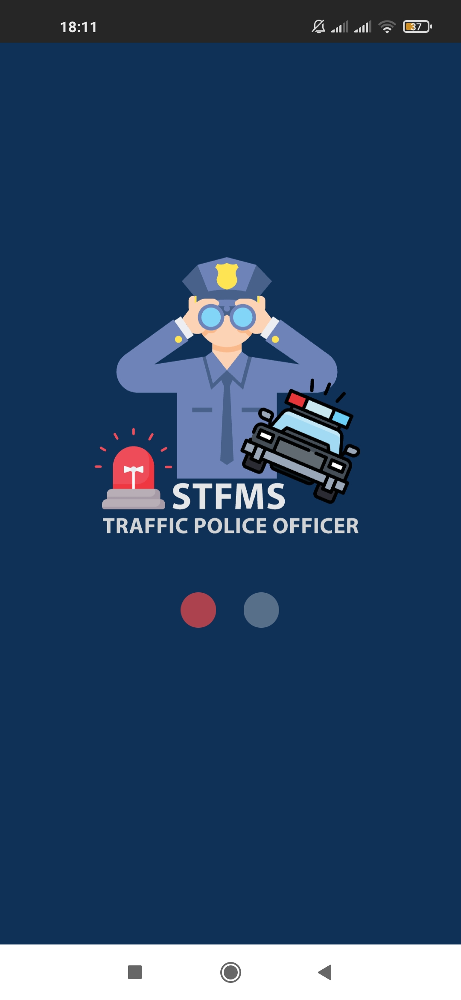
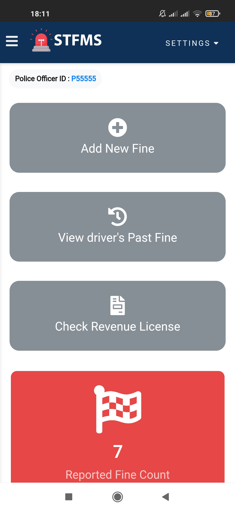

# 2.2-Project-Smart-Traffic-Fine-Management-System

Generally, we know that road traffic violations are occurring while driving on the road. If there is a violation caught by the traffic police officers, they will definitely make a fine according to the violation. So, we know that this process is based on paper works, a manual paying system, and a temporary driver has to hand over the license to a police officer and this process takes more time. Therefore, we have proposed our system to make it smart other than using the normal process. 

The system has major four roles; Traffic Police Admin, Traffic Police Officer, Vehicle Driver, and Department of Motor Traffic. The police officer & vehicle driver has the mobile app & web application, traffic police admin, and department of motor traffic have the web portal. 

 

## Functionalities
✔️ User Login 
✔️ User Registration 
✔️ Forgot Password 
✔️ Issuing New Fine 
✔️ Profile Maintenance 
✔️ Fine Payments Through Online Payment Gateway 
✔️ User Views 
✔️ Data Add, Edit, Delete, View Functionalities 
✔️ Table data Search, Sort, Download (as CSV, PDF, Excel) & Print Option 

## Used Technologies
✔️ PHP 
✔️ MySQL 
✔️ HTML 
✔️ CSS3 
✔️ JavaScript 
✔️ Bootstrap 
✔️ Java 

## Used Tools
✔️ Visual Studio Code 
✔️ Android Studio 

## Team Members
| Lakshitha Dhyan  |    Chathura Ranasinghe    | Dasuni Udugama  |    Samitha Wijesekara    |
| -------------    | ------------- | -------------    | ------------- |
| 

     | 

  | 

     | 

  |
 

## Web Application Screenshots

 

 

 

 

 

 

 

 

   

## Police Officer Mobile Application Screenshots

      

## Driver Mobile Application Screenshots

      
